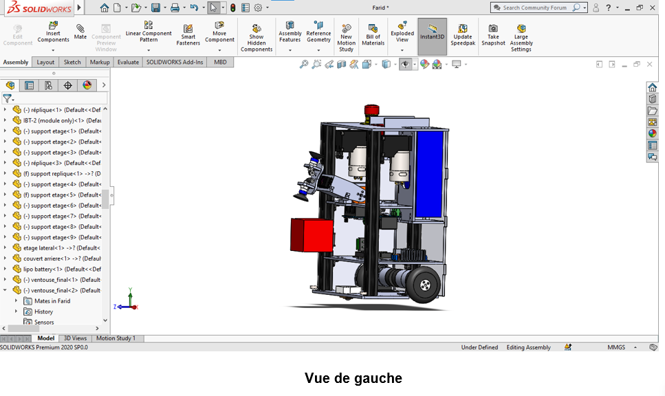

# FRED_Eurobot_Junior_2022

Fred is built to navigate and compete with precision. Using PID motor control for smooth speed regulation, odometry for accurate positioning, and motion primitives for reliable trajectory execution, Fred generates and follows paths autonomously. Its robust motion control ensures it consistently achieves competition objectives.

| Real-Life | CAD Model |
|-----------|-----------|
|  |  |
|  |  |
|  |  |
